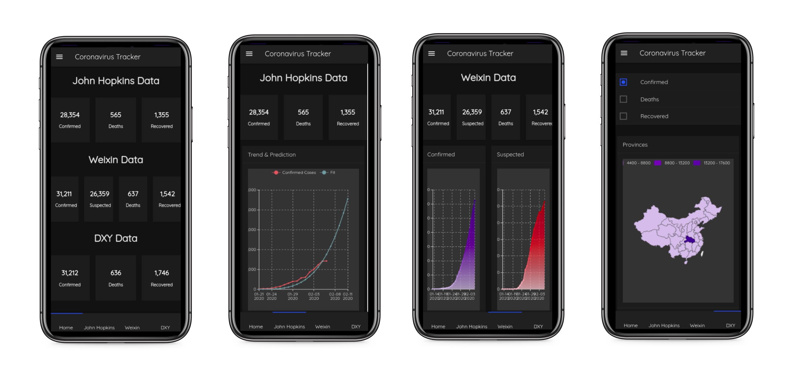
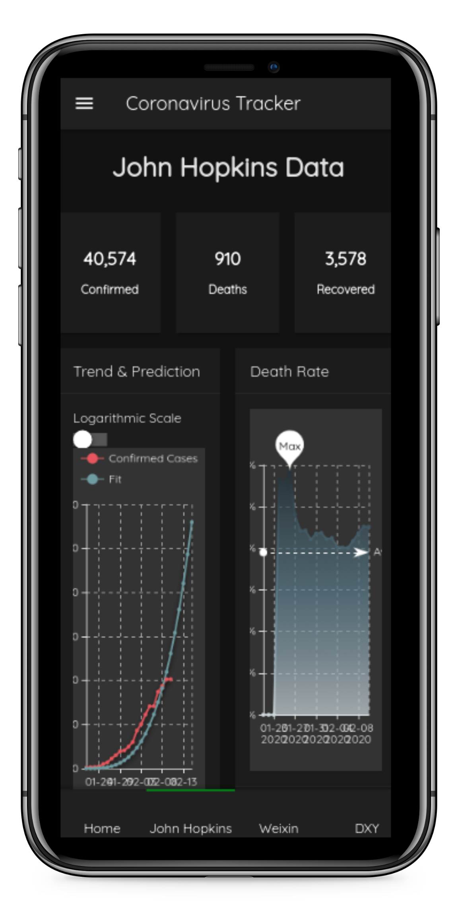
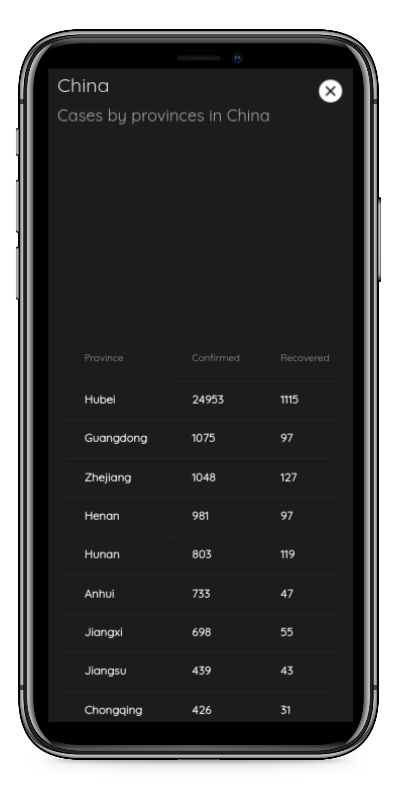
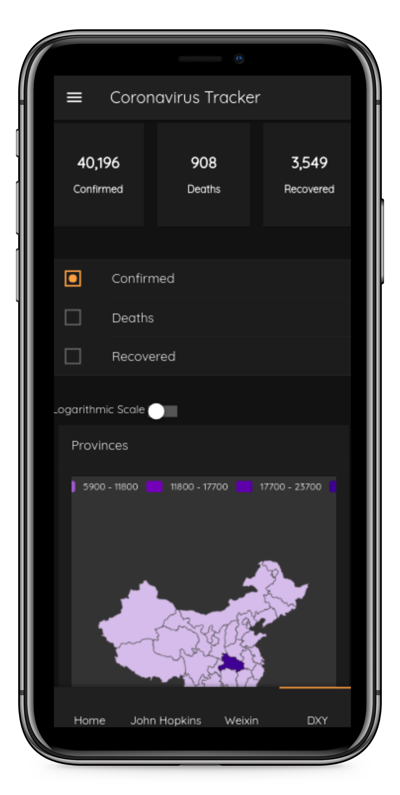
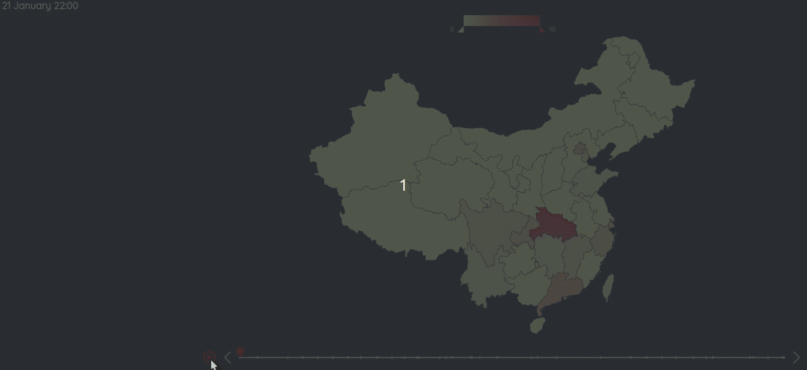

# Tracker

You can visit the live tracker at [**shiny.john-coene.com/coronavirus**](https://shiny.john-coene.com/coronavirus/)

The app is opmitized for mobile.

It provides a great deal of interactive data visualization.

Timeline of confirmed cases by province.

Province and city breakdown.

